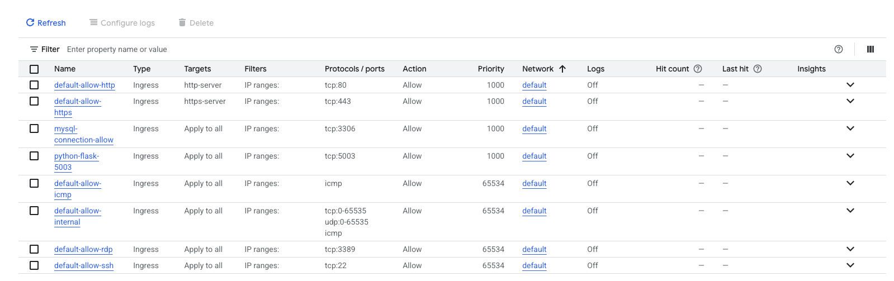
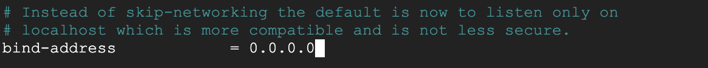
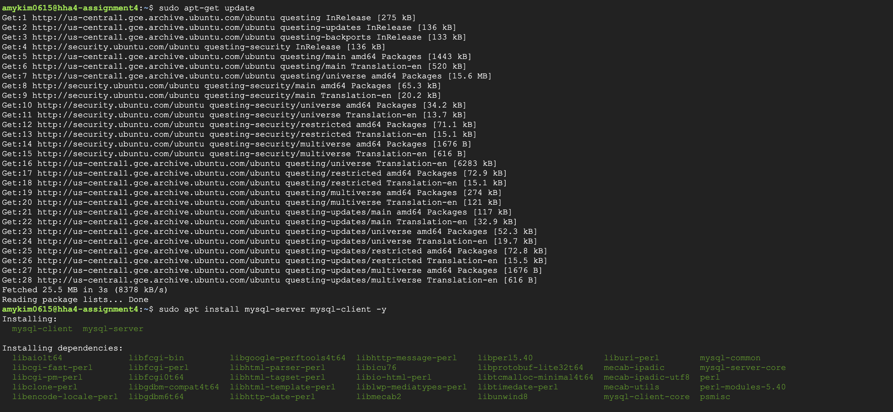
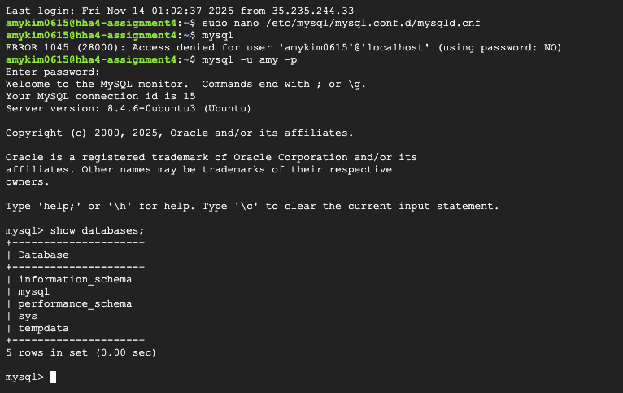
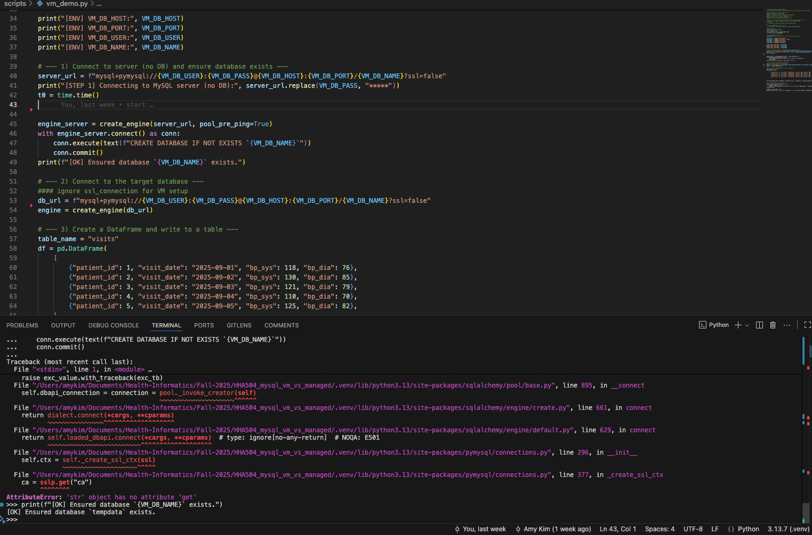
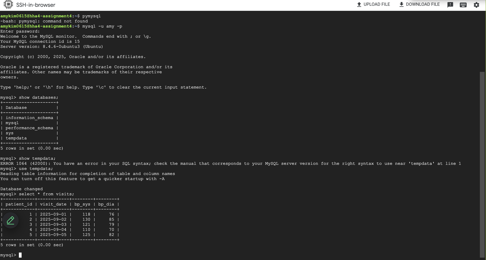
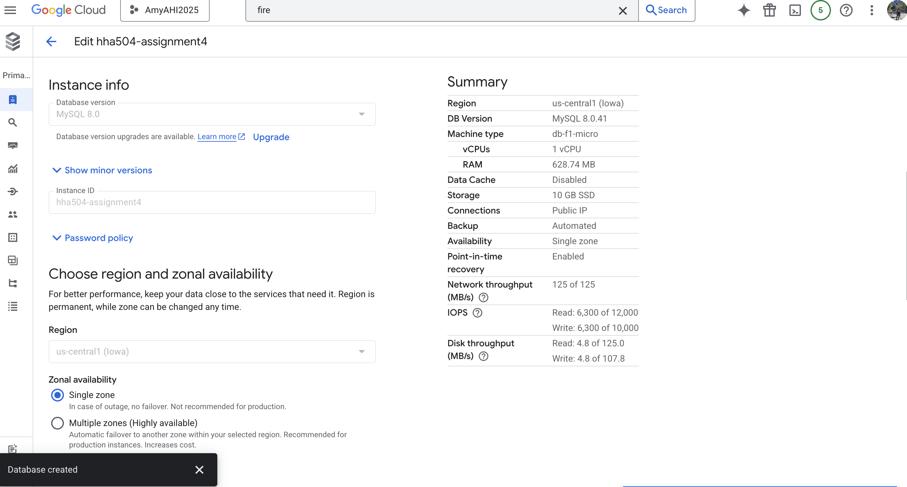
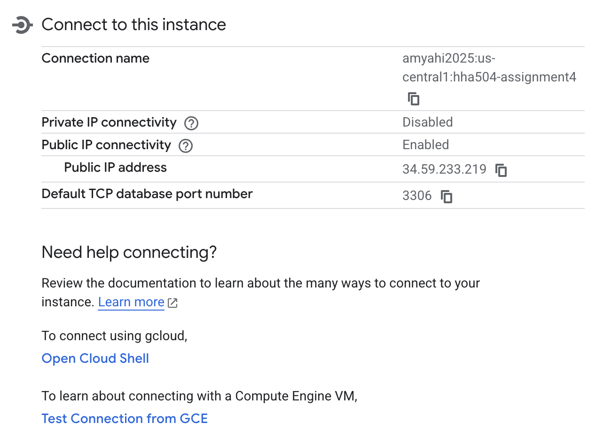
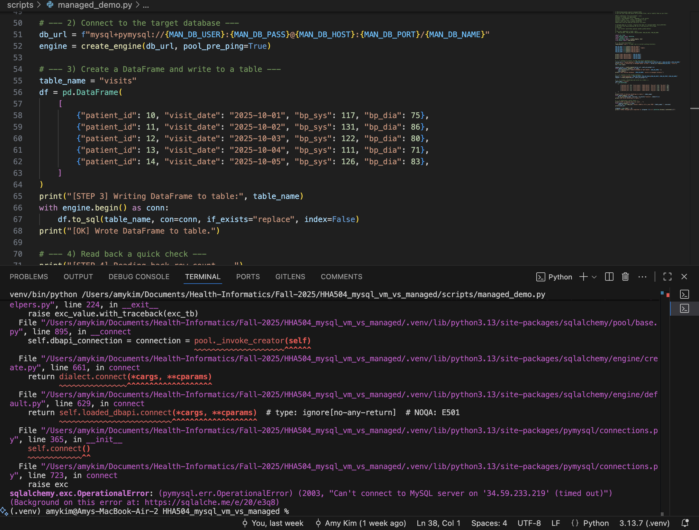

# HHA504_mysql_vm_vs_managed
Assignment 4

Zoom link: https://youtu.be/QKpRqjoxus8 

## Cloud chosen and region
I chose to use self-managed MySQL on Google Compute Engine VM and Google Cloud SQL for the managed MySQL instance.
Self-managed region was Iowa
Managed region was US central 1

# Self-managed MySQL on Google Compute Engine VM
1. Create VM

2. Editing firewall to open port 3306 and modify bind-address allow external entry
 

3. SSH in the VM and installing via sudo apt update

4. Show database

5. Running python script

# Managed MySQL

1. Creation of instance and overview

2. Connection details

3. Failed to run Python code

